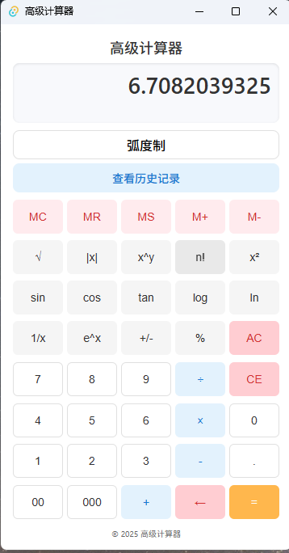

<div align="center">
  <h1>Advanced Calculator (React + Tauri)</h1>
  <p>
    <b>Modern, powerful, and easy-to-use scientific calculator desktop app</b><br/>
    <i>基于 React + Tauri 的现代科学计算器桌面应用</i>
  </p>
  
  <a href="./DEVELOPMENT_GUIDE_CN.md">开发文档（中文）</a> |
  <a href="./DEVELOPMENT_GUIDE_EN.md">Development Guide (EN)</a>
  <br/>
</div>

---

## ✨ 项目简介 | Project Overview

本项目是一个基于 React + Tauri 的高级科学计算器桌面应用，支持基本和科学计算、内存操作、历史记录等功能。界面现代、响应式，适配 Windows 32/64 位系统，支持绿色版与多种安装包输出。

This project is an advanced scientific calculator desktop application based on React + Tauri. It supports basic & scientific calculations, memory operations, history records, and more. The UI is modern and responsive, supporting Windows 32/64-bit systems and portable/installer releases.

---

## 🚀 特性 | Features
- 基础与科学计算（加减乘除、三角函数、开方、幂等）
- 内存操作与历史记录
- 角度/弧度切换
- 响应式极简界面，键盘支持
- 一键打包，支持 32/64 位安装包和绿色版
- 全本地运行，数据隐私安全

---

## 📦 下载 | Download
> <b>安装包和绿色版请前往 Releases 页面：</b>
> 
> [👉 点击下载最新版本 / Download Latest Release](https://github.com/your-username/your-repo/releases/latest)

---

## 🖼️ 截图 | Screenshots
<div align="center">
  
  
  
</div>

---

## 📚 文档 | Documentation
- [开发文档（中文）/ Development Guide (CN)](./DEVELOPMENT_GUIDE_CN.md)
- [Development Guide (EN)](./DEVELOPMENT_GUIDE_EN.md)

---

## 🛠️ 快速开始 | Quick Start
```bash
# 安装依赖
yarn install

# 启动前端开发环境
yarn dev

# 启动桌面端开发环境
yarn tauri dev
```

更多开发、打包、常见问题请见开发文档。

---

<div align="center">
  <sub>© 2025 Advanced Calculator Team | MIT License</sub>
</div>
